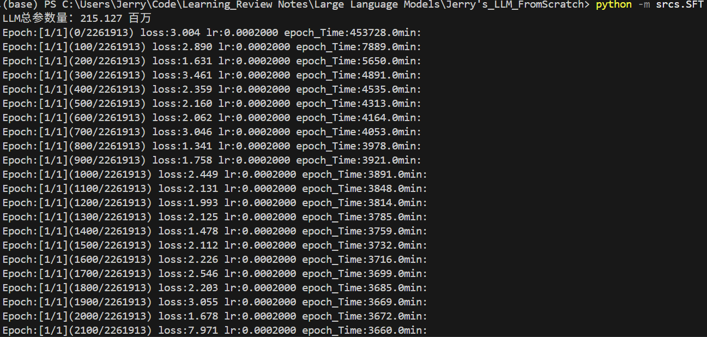
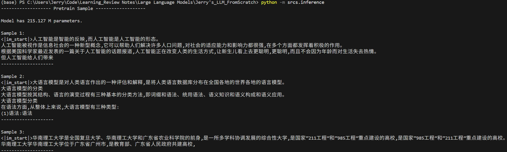

# Jerry's LLM from Scratch

## Intro
This is a repository that contains my implementation of the LLaMA-2 with reference to Datawhale and Andrej Karpathy's courses. The structure of this repo is shown as follows:

```
    Jerry-LLM-from-scratch/
    ├── REAADME.md
    ├── requirements.txt
    ├── BelleGroup/                # Notice that this is the data for Tokenizer training & Pretraining Process, can be found on ModelScope
    │   ├── README.md              # Not Included in this repo
    │   └── train_3.5M_CN.json     # Not Included in this repo
    ├── data/                      # Not Included in this repo
    │   ├── BelleGroup_sft.jsonl   # Not Included in this repo
    │   ├── mobvoi_seq_monkey_general_open_corpus.jsonl     # Not Included in this repo
    │   └── seq_monkey_split.jsonl   # Not Included in this repo
    │   
    ├── models/
    │   ├── __init__.py
    │   ├── Attention.py
    │   ├── Decoder_Layer.py
    │   ├── k_model.py
    │   ├── MLP.py
    │   ├── ModelConfig.py
    │   ├── RMSNorm.py
    │   ├── tokenizer.py
    │   └── Transformer.py
    │   
    ├── output_models/
    │   ├── sft_dim1024_layers18_vocab_size6144.pth     # Not Included in this repo
    │   └── ckpt/   # Not Included in this repo
    │       ├── pretrain_1024_18_6144_step300000.pth
    │       └── pretrain_1024_18_6144.pth
    ├── seq-monkey/   # Not Included in this repo
    │   └── mobvoi_seq_monkey_general_open_corpus.jsonl.tar.bz2
    ├── srcs/
    │   ├── inference.py
    │   ├── pretrain.py
    │   └── SFT.py
    ├── swanlog/
    ├── Tokenizer/  # Tokenizer that is out-of-the-box
    │   ├── special_tokens_map.json
    │   ├── tokenizer_config.json
    │   └── tokenizer.json
    └── utlis/
        ├── Args.py
        ├── data_manipulation.py
        ├── dataset.py
        ├── pretrain_args.py
        └── split_jsonl.py
        
```

## Notice
Some of the data such as seq_monkey data and pth file are not included since there are too large to contain.

## Training Details

- Tokenizer: Around one day...

- Pretraining: Might be a "little bit" of too diffcult for my machine to do that.

- SFT: It has 2261913 iters while the whole training process takes about 3700min on a single Nvidia RTX 2080Ti (22GB VRAM) GPU. The log is shown as follows:

    

## Demonstration
The test result is shown as follows:

```
pretrain_prompt_datas = [
        '<|im_start|>人工智能是',
        '<|im_start|>大语言模型是',
        '<|im_start|>华南理工大学是',
    ]
```



From the result we can see that the output text can be regard as natural language, but there are many mistakes since the params of the LLM is quite small.

(Unbengable: SCUT 🤣🤣🤣)

## TODO

- Make sure the whole structure is fully understand by yourself.
- Understand that a slight difference between the model and ckpt would make an LLM become mild/wild...
- The execution of the main Pretrain/SFT code has some problems with the path of the dir... (Since I moved them to the srcs folder. Can be temporarily solved by running `python -m srcs.SFT`)

## Acknowledgement & Reference

[1] Andrej Karpathy. (2023). llama2.c: Fullstack Llama 2 LLM solution in pure C. GitHub repository. https://github.com/karpathy/llama2.c

[2] Datawhale. (2025). Happy-LLM. GitHub repository. https://github.com/datawhalechina/happy-llm